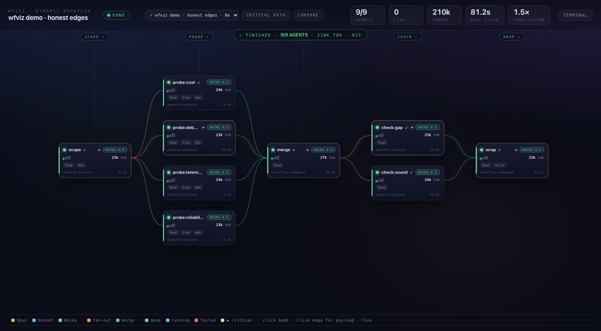
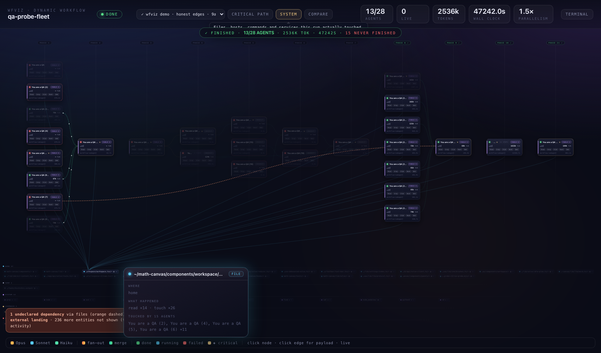
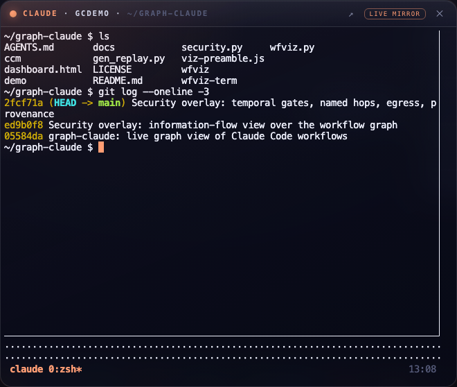

# graph-claude

A live graph view of Claude Code dynamic workflows. Each node is one subagent.
Each edge is data passed from one agent's output into another's prompt.

<video src="https://github.com/trwilcoxson/graph-claude/raw/main/docs/demo.mp4"
       poster="docs/demo-poster.png" controls muted autoplay loop playsinline width="100%"></video>

[Watch the demo](docs/demo.mp4) — one workflow from launch to finish, then every feature.



## Why a graph

A Claude Code workflow spawns a fleet of subagents from a JavaScript
orchestration script. The script decides what runs in parallel, what waits, and
what feeds what. That structure is a directed acyclic graph, but the terminal
prints it as a list of progress lines.

The list hides what you need when a run misbehaves:

- which agents ran at the same time, and which sat waiting
- which chain of dependent agents set the total run time
- whether a step received its upstream output, or ran without it
- which model and reasoning level each agent used, and what that cost

A graph shows all of it at once. This tool builds that graph from files the
workflow already writes, so it works on runs started before you installed it.

## Install

Requires Python 3.9+ (standard library only) and Claude Code. `tmux` and `ttyd`
are optional and only needed for the terminal panel.

```bash
git clone https://github.com/trwilcoxson/graph-claude.git
cd graph-claude
./install.sh
```

The installer registers a `PreToolUse` hook on the Workflow tool in
`~/.claude/settings.json`, so the graph opens by itself whenever a workflow
runs. It backs the file up first, keeps any hooks and settings you already have,
and is safe to run twice. `./install.sh --status` shows what is installed and
`./install.sh --uninstall` removes it.

**Restart Claude Code after installing.** Hooks are loaded when a session
starts, so a session that is already open will not pick up the new hook.

To open the graph without waiting for a workflow:

```bash
./wfviz          # graph only
./wfviz-term     # graph plus the terminal panel
```

It finds the most recent workflow across your Claude Code sessions and follows
it while it runs.

Controls: scroll to zoom, drag to pan, double-click to refit, click a node for
its transcript, click an edge for the data that crossed it, Tab and Enter for
keyboard access.

## How it reads a run

Claude Code writes two kinds of files. The completion records
(`tasks/<id>.output`, `workflows/<id>.json`) are written only when a run ends,
so polling them shows nothing until it is over. These update during the run:

| file | contains |
|---|---|
| `subagents/workflows/wf_<id>/journal.jsonl` | per-agent start and result, appended line by line |
| `subagents/workflows/wf_<id>/agent-<id>.jsonl` | that agent's transcript: prompt, tool calls, tokens, timings |
| `subagents/workflows/wf_<id>/agent-<id>.meta.json` | agent type and model alias |

The server tails those. The completion record is used when it appears, to mark
the run finished and fill in final token totals.

Node labels and dependencies are in none of those files. A workflow supplies
them by prefixing each agent's prompt with a `⟦wfnode {...}⟧` header, which the
server parses back out of the transcript. Without the header you still get a
graph, with labels derived from each prompt and layout inferred from start
times.

## Authoring a workflow

Copy `viz-preamble.js` into a workflow script and call `vnodeFrom` instead of
`agent`:

```js
phase('Probe')
const probes = await parallel(ANGLES.map((k) => () =>
  vnodeFrom({ scope: scope.finding },
    `Expand the "${k}" angle in ~60 words.`,
    { label: `probe:${k}`, phase: 'Probe', schema: R, model: 'haiku', effort: 'low',
      agentType: 'general-purpose', tools: ['Read', 'Web'] })))
```

`vnodeFrom` takes the upstream results as its first argument. It injects them
into the prompt and derives the edges from the same keys, so an edge on screen
always corresponds to data the downstream agent received. Declaring dependencies
by hand lets the two drift apart, giving you a graph that shows a connection
while the agent runs without the input.

`vnode` is the lower-level form if you want to declare `deps` yourself. Both
accept `role` (`router`, `verifier`, `reducer`, `judge`) to give a node a
distinct appearance.

## What the graph shows

Per node: label, phase, model with version (Haiku 4.5, Opus 5), reasoning
effort, tools, tokens, tool calls, duration, state. Hovering streams the agent's
tool calls as they happen. Clicking opens the transcript and result.

Per edge: fan-out, merge, or plain flow, plus the payload that crossed it. Edges
carrying data animate. Edges whose endpoints are both finished go still, so
movement on screen means work in progress.

Derived measures:

- **Critical path.** The longest duration-weighted chain. Shortening anything
  off this path does not make the run faster. Marked with a diamond, isolated by
  the CRITICAL PATH button.
- **Float.** Per node, how long it could overrun before delaying the run. Zero
  float means it is on the critical path.
- **Parallelism.** Total agent time divided by critical path length. A value
  near 1.0 means the run was mostly serial despite its shape.
- **Broken edges.** Dependencies naming a node that does not exist, reported
  rather than dropped.
- **Cycles.** Found with a depth-first search for back edges.

Deep runs are contracted before drawing. A run of nodes that each have one
predecessor and one successor carries no branching, so it collapses into a
single node showing the step count and summed totals. Click it to list the
members. The largest run tested here is 155 nodes across 126 columns, which is a
40,000 pixel canvas uncontracted.

## System context

The workflow DAG stops at the process boundary. The SYSTEM button extends it
into what the run actually touched: files, hosts, commands, search queries and
MCP services, each placed in a zone by how far out it sits.



| zone | meaning |
|---|---|
| workspace, home | paths under the working directory or your home |
| system, temp | everything else on the machine |
| loopback, local network | 127.0.0.1, private ranges, `.local` |
| internet | public hosts |
| service | MCP servers |

Entities are laid out in lanes and connect to agents on focus rather than all at
once, because drawing every link is a hairball (355 on one real run). Hover an
entity to see which agents touched it and how; hover an agent to see what it
reached. Click either for the full operation list.

Three relationships are derived, and each needs two recorded operations to
exist:

- **Undeclared dependency.** Agent A writes a file, agent B later reads it. That
  is a real dependency, and if the declared graph does not contain it the edge is
  drawn in orange. This is the most common way a workflow is wrong invisibly.
- **Write contention.** Two agents writing the same path.
- **External landing.** An agent fetched from the internet and wrote to disk in
  the same run, so remote content reached the filesystem.

Everything comes from a recorded tool call. Nothing is inferred from
reachability alone.

## Terminal panel



`./wfviz-term` opens the graph with a terminal panel attached to a tmux session,
so you can drive Claude Code from the same window as the graph. Start sessions
with `./ccm` to make them mirrorable. A session already running outside tmux
cannot be attached to after the fact, because a process cannot hand its live TTY
to tmux. For those the panel shows a read-only feed of the session transcript.

## Files

| file | purpose |
|---|---|
| `wfviz.py` | server: reads run files, builds the graph, serves `/state`, `/agent`, `/runs`, `/compare` |
| `dashboard.html` | the graph UI |
| `context.py` | system-context layer: entities, zones, derived relationships |
| `viz-preamble.js` | `vnode` and `vnodeFrom` authoring helpers |
| `gen_replay.py` | bakes a finished run into a standalone HTML replay |
| `demo/demo-workflow.js` | example workflow where every edge carries data |
| `wfviz`, `wfviz-term`, `ccm` | launchers |
| `install.sh` | registers/removes the Workflow hook |

## Notes

Claude's extended thinking is stored encrypted. Transcripts contain
`{"type":"thinking","thinking":"","signature":"..."}`, so there is no plaintext
reasoning to display. The hover panel shows the observable trace instead: tool
calls, arguments, results, and timings.

## License

MIT
